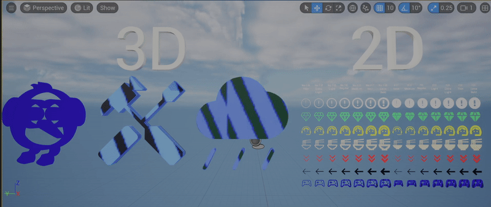

# GoIcons: 3000+ Free Icons for Unreal Engine

* * *

This plugin makes it easier to work with Google Symbols icons in Unreal. 

It includes two classes:

- IconTextBlock: A child of TextBlock, this is for 2D / UMG. Drag and drop this into a Widget and you'll get all the icons!
- IconText3DActor: A child of Text3DActor, this is an actor that can be placed in a Level which renders an Icon in 3D!

### See it in action!

