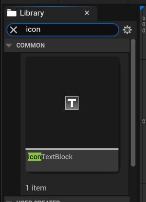
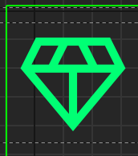

# Usage in 2D (UMG)

* * *

To use icons in a widget, you will use the `IconTextBlock` component.

### First, make an `IconTextBlock` component

### Once created, you will be presented with these options:

- **Fill**: Whether the icon should be filled in or not
- **Typeface**: The thickness of the icon 
- **Selected Glyph**: The icon you want to use by name

### Example Usage

- **Fill**: No
- **Typeface**: Light
- **Selected Glyph**: Diamond

