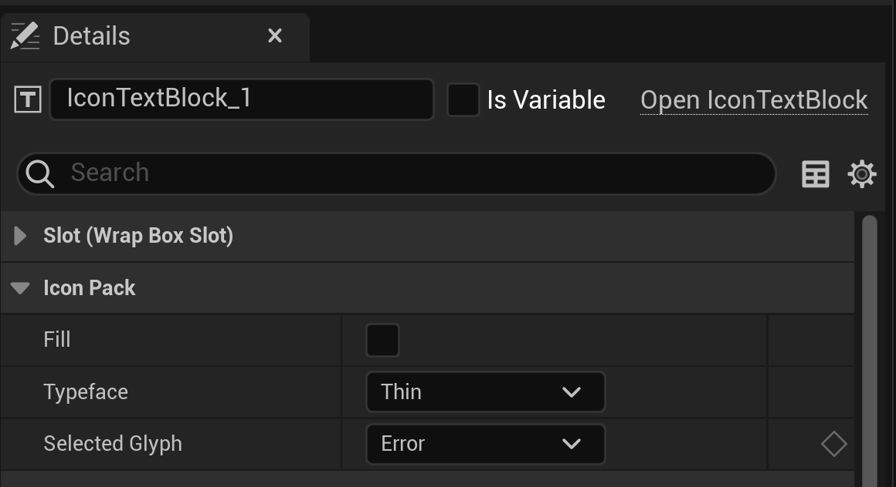

# Usage in 3D

* * *

To use icons in a scene, you will use the `IconText3DActor` actor.

### First, make an `IconText3DActor` actor

### Once created, you will be presented with these options:

- **Fill**: Whether the icon should be filled in or not
- **Typeface**: The thickness of the icon 
- **Selected Glyph**: The icon you want to use by name

### Example Usage

- **Fill**: Yes
- **Typeface**: Thin
- **Selected Glyph**: Flutter Dash

